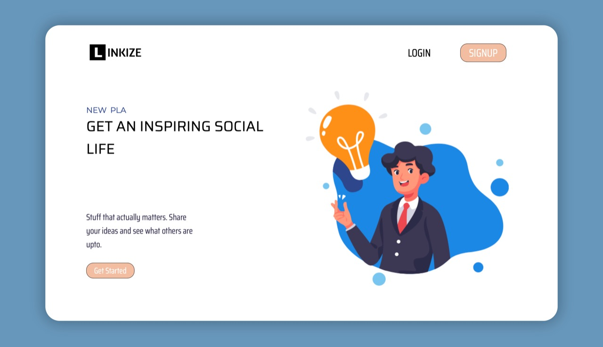
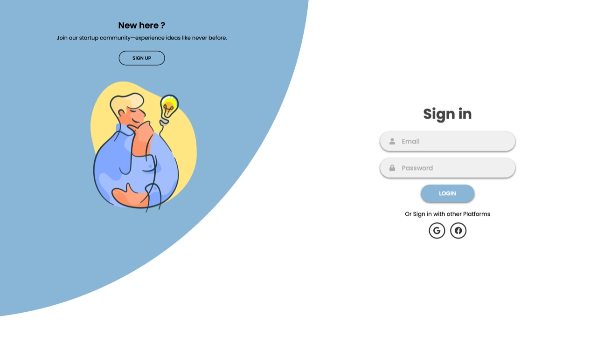
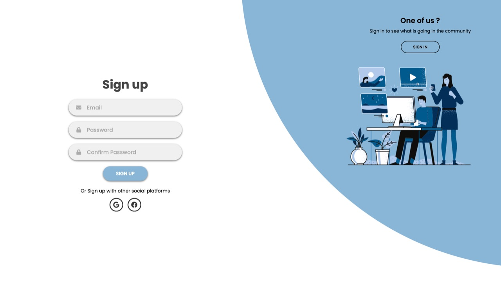
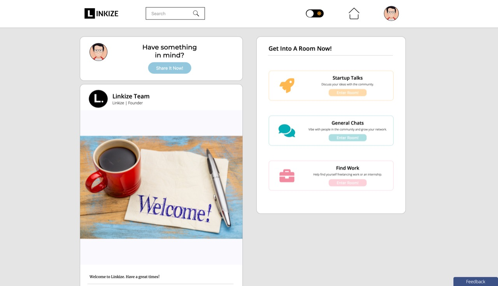

<h1 align="center">Welcome to Linkize 👋</h1>
<p>
  
  <a href="#" target="_blank">
    
  </a>
</p>

> Social Media Application
## Project Description

Social media application for webkriti. 

* Users can create their account in our database and sign in or directly sign in through google authentication.
* Once the user is successfully signed in, they will be redirected to the complete their profile page to fill in other necessary details.
* The user can see every post posted by other users on their home page and can like them.
* The home page also contains an option to post their thoughts (post) with an image.
* Also, there are rooms made for users to chat about topics with everyone online in the community. 
* Also, other users can be searched, and the user can view that user's profile. 
* Users can also send us feedback that will be mailed to us.
* Lastly, a view profile page exists wherein users can see all their posts, delete them, or even update. 
* We have also added light and dark modes for user's viewing comfort.

# Screen shots
</img>
</img>
</img>
</img>
</img>
### 🏠 [Homepage](/public)

### ✨ [Deployed site](https://linkize.herokuapp.com/)

# Features Implemented

## Front-end

## Back-end
1. Routes for authentication purpose
* We have setup basic authentication & also implemented google & facebook passport strategy 
* Currently facebook auth is working locally but giving issues on deployed website
```
/auth/signin
/auth/signup
/auth/google
/auth/facebook
```
2. Details route to get, update, view or search other profiles
```
/details/getdetails
/profile/:userid
/search
```
3. Feedback route to send mail to us using node mailer
```
/feedback/sendmail
```
4. Posts route to create a new post, get all posts, update / dislike post, update / delete post
* We are verifying token as middleware for every post, put, update or delete request
```
/posts/createnewpost
/posts/getallposts
/posts/updatelike/:postid
/posts/updateddislike/:postid
/posts/updatepost/:postid
/posts/deletepost/:postid
/posts/profile/:username
/posts/getpics
```
5. Rooms
* By this user can join room by verify token & to send name, userid to socket connection
```
/rooms/joinroom
```
# Technologies/Libraries/Packages Used
| Packages | README |
| ------ | ------ |
| bcrypt | To store hashed password in database  |
| dotenv | To keep db connection string, client id, client secret key safe  |
| image-to-base64 | To convert images of posts or image url to base 64 & storing in database  |
| jsonwebtoken | To store users session encrypted and verify them as middleware in posts/details/feedback api request  |
| moment-timezone | To handle time zone and send in socket connection  |
| nodemailer | To send feedback to our mail  |
| nodemon | To run application in dev mode  |
| passport-facebook | Facebook authentication  |
| passport-google-oauth20 | Google authentication  |
| pg | To Connect to AWS RDS  |
| socket.io | To enables realtime, bi-directional communication between web clients and servers.  |

## Local Setup
1.  To run the server in dev mode use
    ```sh
    npm run dev
    ```
2.  To run the server in production mode
    ```sh 
    npm start 
    ```
3.  Note that database connection string, passport client id & secret keys are in env file which are not uploaded on github


### Built With
<a href="https://expressjs.com" target="_blank">  </a>


## Contact

👤 **Sohan Bandary, Swahim Namdev, Ranjith Jupaka**

### Sohan
* Github: [@sohan2410](https://github.com/sohan2410)
* LinkedIn: [@sohan-bandary](https://linkedin.com/in/sohan-bandary)
* Gmail: [mail](mailto:bandarysohan24@gmail.com)
* Instagram: [@sohan24.py](https://www.instagram.com/sohan24.py/)

### Swahim
* Github: [@swahim](https://github.com/swahim)
* LinkedIn: [@swahimnamdev](https://www.linkedin.com/in/swahimnamdev/)
* Gmail: [mail](mailto:swahimn@gmail.com)
* Instagram: [@swahim_n](https://www.instagram.com/swahim_n/)

### Ranjith
* Github: [@ranjithcoder](https://github.com/ranjithcoder)
* LinkedIn: [@jupaka-ranjith-998675164](https://www.linkedin.com/in/jupaka-ranjith-998675164/)
* Instagram: [@ranjithjupaka_1](https://www.instagram.com/ranjithjupaka_1/)

## Show your support

Give a ⭐️ if this project helped you!

